#Part 5 - Troubleshoot your custom user journeys

Microsoft Corporation
Published: July 2016
Version: 0.3 (DRAFT)

Author: Philippe Beraud (Microsoft France), Jose Rojas (Microsoft
Corporation)
Reviewers: Kim Cameron, Brandon Murdoch, Ronny Bjones (Microsoft
Corporation)

For the latest information on Azure Active Directory, please see

http://azure.microsoft.com/en-us/services/active-directory/

Copyright© 2016 Microsoft Corporation. All rights reserved.

Abstract: Azure AD, the Identity Management as a Service (IDaaS) cloud
multi-tenant service with proven ability to handle billions of
authentications per day, extends its capabilities to manage consumer
identities with a new service for Business-to-Consumer: Azure AD B2C.

Azure AD B2C is "IDaaS for Customers and Citizens” designed with Azure
AD privacy, security, availability, and scalability for customer/citizen
Identity management (IDM). It’s a comprehensive, cloud-based, 100%
policy driven solution where declarative policies encode the identity
behaviors and experiences as well as the relationships of trust and
authority inside a Trust Framework (TF).

Whilst the Azure AD B2C Basic leverages a dedicated TF tailored by
Microsoft, i.e. the “Microsoft Basic Trust Framework” in which you can
customize policies, the Premium edition gives you full control, and thus
allows you to author and create your own Trust Framework through
declarative policies. It thus provides you with all the requirements of
an Identity “Hub”.

This document is intended for IT professionals, system architects, and
developers who are interested in understanding the advanced capabilities
Azure AD B2C Premium provides, and more especially in this context how
to troubleshoot your own specific policies for your custom user
journeys.

Table of Content

[Notice](#notice)

[Introduction](#introduction)

[Objectives of this document](#objectives-of-this-document)

[Non-objectives of this paper](#non-objectives-of-this-paper)

[Organization of this paper](#organization-of-this-paper)

[About the audience](#about-the-audience)

[Using Fiddler](#using-fiddler)

[Using the user journey recorder/player](#using-the-user-journey-recorderplayer)

[Placing the desired relying party policy in "Development" mode](#placing-the-desired-relying-party-policy-in-development-mode)

[Running your policy as usual](#running-your-policy-as-usual)

[Reviewing the output using the user journey player](#reviewing-the-output-using-the-user-journey-player)

[Using your own recorder/player endpoint](#using-your-own-recorderplayer-endpoint)

[Understanding the prerequisites of the user journey recorder](#understanding-the-prerequisites-of-the-user-journey-recorder)

[Building your user journey recorder/player](#building-your-user-journey-recorderplayer)

[Deploying your own user journey recorder](#deploying-your-own-user-journey-recorder)

Notice
======

This document illustrates new capabilities of Azure AD through the just
made available public preview of the Azure AD B2C service. This public
preview may be substantially modified before GA.

**This document will be updated to reflect the changes introduced at GA
time.**

**This document reflects current views and assumptions as of the date of
development and is subject to change.  Actual and future results and
trends may differ materially from any forward-looking statements. 
Microsoft assumes no responsibility for errors or omissions in the
materials.  **

**THIS DOCUMENT IS FOR INFORMATIONAL AND TRAINING PURPOSES ONLY AND IS
PROVIDED "AS IS" WITHOUT WARRANTY OF ANY KIND, WHETHER EXPRESS OR
IMPLIED, INCLUDING BUT NOT LIMITED TO THE IMPLIED WARRANTIES OF
MERCHANTABILITY, FITNESS FOR A PARTICULAR PURPOSE, AND
NON-INFRINGEMENT.**

Introduction
=============

Azure AD B2C is a cloud identity service for your
consumer-facing web and mobile applications. Azure AD B2C is designed to
solve the identity management challenges that have emerged, as economic
and competitive pressures drive commercial enterprises, educational
institutions, and government agencies to shift their service delivery
channels from face-to-face engagements to online web and mobile
applications.

Based on standardized protocols, Azure AD B2C is "IDaaS for Customers
and Citizens” designed with Azure AD privacy, security, availability,
and scalability for customer/citizen Identity management (IDM). The
“secret sauce” of Azure AD B2C to achieve the above objectives resides
in the 100% policy driven identity experience engine that consume fit to
purpose declarative policies.

Many of the most frequently used identity use cases can be addresses
using the B2C extension in the Azure portal as the developer control
surface. However, there some advanced features only available by writing
custom user journeys which must be configured directly into policy XML
files and uploaded to the B2C tenant. Access to this incremental feature
set is available via the Premium edition of Azure AD B2C.

**Note** For a basic level of proficiency with the policy configuration
available directly in the B2C Admin portal, see the introduction video
[Business-to-Consumer Identity
Management with Azure Active
Directory B2C](https://channel9.msdn.com/Events/Build/2016/P423)
where all the relevant B2C Admin **portal** settings are.

Objectives of this document
---------------------------

This fifth part further discusses how to troubleshoot your tailored for
specific purpose policy XML files. To troubleshoot your custom user
journeys, it features the so-called “User Journey Recorder/Player” tool
that is part of the “Starter Pack” of the Azure AD B2C Premium edition.

The “User Journey Recorder/Player” tool is a nearly essential tool for
developing identity experiences with Azure AD B2C Premium. It captures
the output from the Azure AD B2C identity experience engine as it
brokers the users’ identity journey between the application (relying
party), the identity provider (e.g. Facebook or local account), and any
other claims providers (e.g. MFA, or the Azure AD directory) along the
path. It works in real-time, showing each of the orchestrations steps
that complete the journey, including the claims exchanged between them.
It is thus intended to help you troubleshoot your common use cases so
that you can smoothly and seamlessly instantiate your own specific to
purpose tailored identity “Hub” based on the advanced capabilities of
Azure AD B2C Premium.

> **Important note** Due to the visibility provided by the “User Journey
> Recorder/Player” tool, it should ONLY be used during development and
> testing. To preserve user privacy, it should never be used in
> production/go live policies. Any policies in production that are
> flagged as “Development” mode are subject to be systematically
> disable.

This document covers how to leverage the above Azure AD B2C Premium
recorder mechanism to help troubleshoot your own specific policy XML
files. It also illustrates how to use your own recorder/player endpoints
in lieu of the one provided by the “Starter Pack” of Azure AD B2C
Premium and provides in this context an end-to-end walkthrough from
getting the source code of the tool in the GitHub repository of the
“Starter Pack” to the classic use of the tool once deployed in Microsoft
Azure as web site.

Non-objectives of this paper
----------------------------

This the series of
document is not intended as an overview document for the Azure AD
offerings but rather focusses on the Azure AD B2C identity service, and
more specifically on the premium edition.

> **Note** For additional information, see the Microsoft MSDN article
> [Getting started with Azure
> AD](http://msdn.microsoft.com/en-us/library/dn655157.aspx).
> As well as the whitepapers [Active Directory from the
> on-premises to the
> cloud](ttp://www.microsoft.com/en-us/download/details.aspx?id=36391)
> and [An overview of Azure
> AD](ttp://www.microsoft.com/en-us/download/details.aspx?id=36391)
> as part of the same series of documents.

Organization of this paper
--------------------------

To cover the aforementioned objectives, this document of the series is
organized in the following three sections:

-   Using Fiddler.

-   Using the user journey
    > recorder.

-   Using your own
    > recorder/player endpoint.

These sections provide the information details necessary to leverage the
new capabilities introduced by the “User Journey Recorder/Player” tool
that will help you troubleshoot your own (Trust Framework) policy XML
files so that you can eventually implement the custom user journeys you
want.

About the audience
------------------

This document is intended for IT professionals, system architects, and
developers who are interested in understanding the advanced capabilities
Azure AD B2C Premium provides with all the requirements of an Identity
“Hub”, and in this context how to diagnose the behavior of your user
journeys based on the already available features as per the currently
available public preview.

Using Fiddler
=============

For troubleshooting a specific premium policy in production environment,
and as a starting point, you can turn on network traffic capturing on
Internet Explorer or Edge, or observe the traffic via a tool like the
[Telerik Fiddler](http://www.telerik.com/fiddler) application.
Acting as a proxy server, Fiddler allows you to watch HTTP/HTTPS
traffic, set breakpoints, and "fiddle" with incoming or outgoing data.

> **Note** Likewise, and depending on the browser you use, you may also
> leverage specific extension or plugin.

As far as Fiddler is concerned, we do recommend version 4.6 or later for
correct decoding. Moreover, the article [Configure Fiddler to Decrypt HTTPS
Traffic](http://docs.telerik.com/fiddler/Configure-Fiddler/Tasks/DecryptHTTPS)
provides you with guidance on how to configure the tool for debugging
HTTPS traffic.

This said, we DO advise to leverage the user journey recorder/player for
a premium policy that is placed in “Development” mode. This is the
purpose of the next section.

Using the user journey recorder/player
======================================

Beyond troubleshooting a specific premium policy in production
environment at the network traffic level, IT professionals naturally
expect the ability to view a funnel of activity, and thus to be in a
position to dig into the specific details of a journey segment, e.g. an
orchestration step of the premium policy being executed.

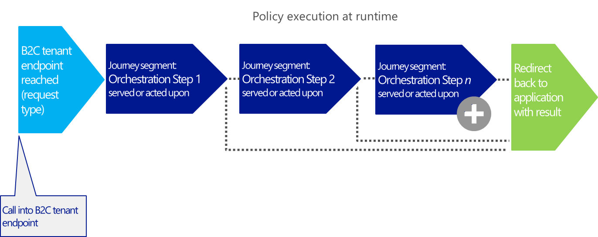 

As outlined before, this is the objectives of the user journey
recorder/player for a premium policy that is placed in “Development”
mode.

Placing the desired relying party policy in "Development" mode
--------------------------------------------------------------

To place the desired relying party policy in "Development" mode, proceed
with the following steps:

1.  Download the desired policy from the B2C portal in Azure at
    > [https://portal.azure.com](https://portal.azure.com).

2.  Open the policy for edit. An XML editor such as Notepad++ or Visual
    > Studio is recommended).

3.  At the top of the policy XML file, locate the *TrustFrameworkPolicy*
    > element.

4.  Inside the *TrustFrameworkPolicy* element, add the following two
    > attributes:

<!-- -->

a.  DeploymentMode=“Development”.

b.  UserJourneyRecorderEndpoint="&lt;*recorder\_endpoint*&gt;?&lt;*guid*&gt;"

> Where:

-   &lt;*recorder\_endpoint*&gt; corresponds to the current recorder
    > endpoint the service is at: (this is what goes in the policy
    > itself). As of this writing, the live endpoint of the Starter Pack
    > is:

> [https://b2crecorder.azurewebsites.net/](https://b2crecorder.azurewebsites.net/)

-   &lt;*guid*&gt; is the GUID of the policy. Each policy should have
    > its own GUID. In order to create your own guid for this policy and
    > use it in the policy argument, you may use
    > [http://guidgen.com](http://guidgen.com). To create a custom
    > GUID with this online tool, click **Generate new GUID**.

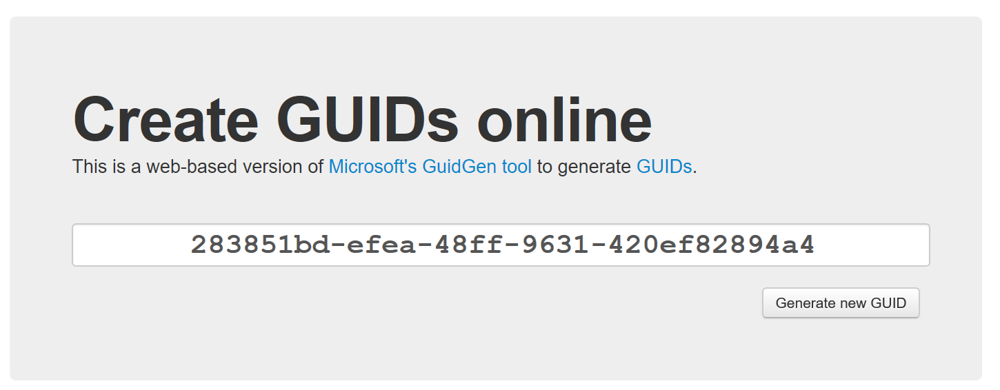

> The following XML snippet illustrates how this looks like in our
> illustration:

&lt;?xml version="1.0" encoding="utf-8"?&gt;

&lt;TrustFrameworkPolicy
xmlns:xsi="http://www.w3.org/2001/XMLSchema-instance"

xmlns:xsd="http://www.w3.org/2001/XMLSchema"

xmlns="http://schemas.microsoft.com/online/cpim/schemas/2013/06"

PolicySchemaVersion="0.3.0.0"

TenantId="contoso369b2c.onmicrosoft.com"

PolicyId="B2C\_1A\_B2CSamplePolicy"

PublicPolicyUri="http://contoso369b2c.onmicrosoft.com/"

DeploymentMode="Development"

UserJourneyRecorderEndpoint="https://b2crecorder.azurewebsites.net/stream?id=42193212-2f4e-4f5f-93b0-fd8dd6610b5f"

…&gt;

…

&lt;/TrustFrameworkPolicy&gt;

1.  Save the policy.

2.  Upload the saved policy XML file to your B2C tenant.

Running your policy as usual
-----------------------------

To record the user journey with the user journey recorder, you need to
run the uploaded policy as usual via **Run Now** for testing from the
policy blade of the B2C portal in Azure or from a suitable B2C
application.

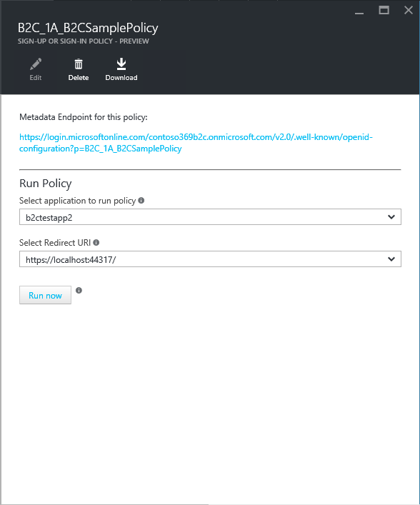

Recorded information entries include in a non-exhaustive manner: event
name, correlation id, user journey id, policy id, tenant id, operation’s
kind, operation start/end, variables’ state of the identity experience
engine, result, orchestration step being executed, technical profile id,
etc.

Reviewing the output using the user journey player
--------------------------------------------------

To review the output using the user journey player, proceed with the
following steps:

1.  Open a browsing session and navigate to &gt; where:

-   &lt;*recorder\_player*&gt; corresponds to the page *trace\_102.html*
    > of the current recorder endpoint the service is at: As of this
    > writing, the URL is:

> [https://b2crecorder.azurewebsites.net/trace\_102.html](https://b2crecorder.azurewebsites.net/trace_102.html)

-   &lt;*guid*&gt; is the GUID of the policy.

> In our illustration, the complete URL is:
>
> [https://b2crecorder.azurewebsites.net/trace\_102.html?id=42193212-2f4e-4f5f-93b0-fd8dd6610b5f](https://b2crecorder.azurewebsites.net/trace_102.html?id=42193212-2f4e-4f5f-93b0-fd8dd6610b5f)

Substitute the GUID with the GUID from your policy.

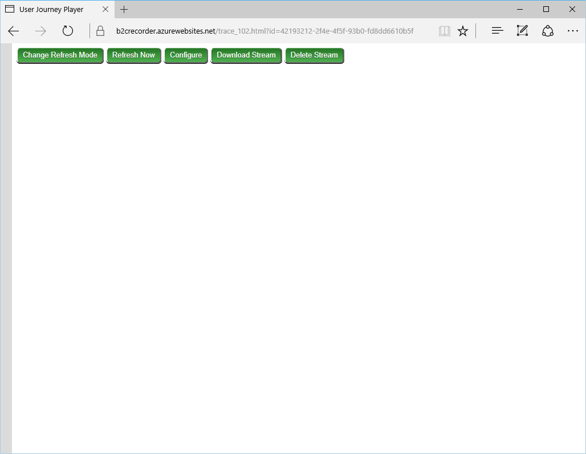

1.  Use **Refresh Now** to see your recording. The details of the user
    journey will show up.

> **Note** Incremental runs of a policy using the same GUID will be
> appended to this report.

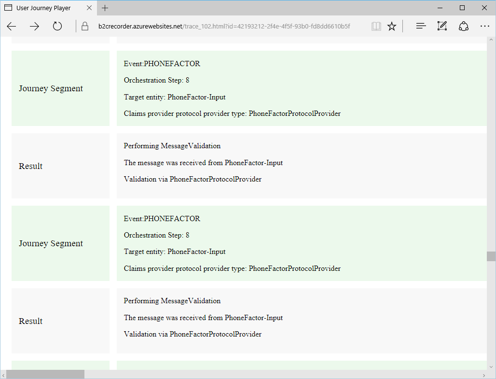

The following snapshot shows orchestration step 0, i.e. the beginning of
a user journey.

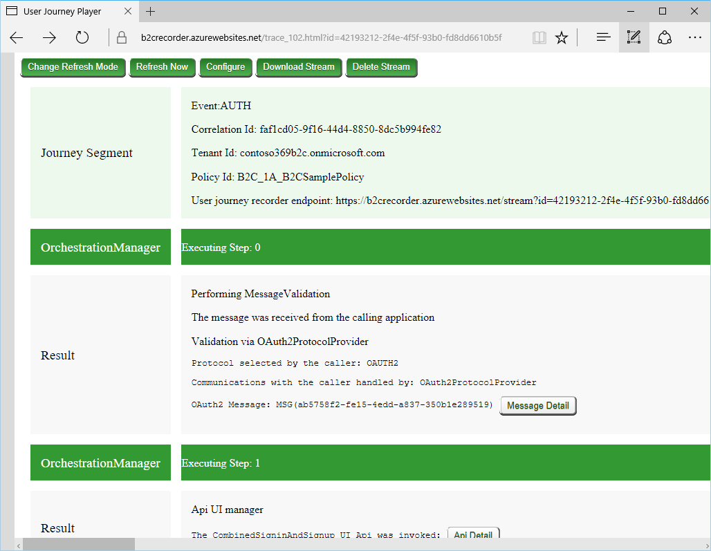

The following snapshot shows orchestration step 9 and the details of a
claims exchange.

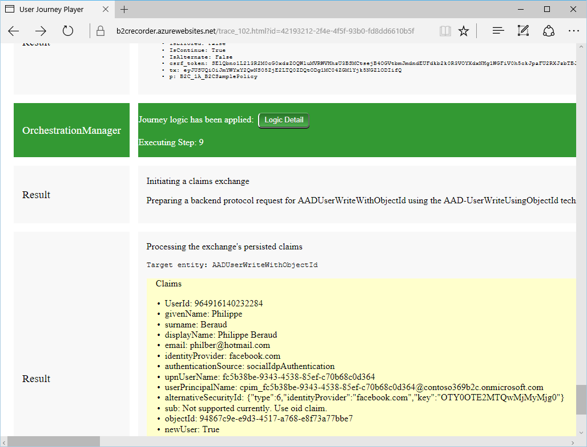

1.  Use **Configure** to modify the configuration of the “User Journey
    > Recorder/Reader” tool.

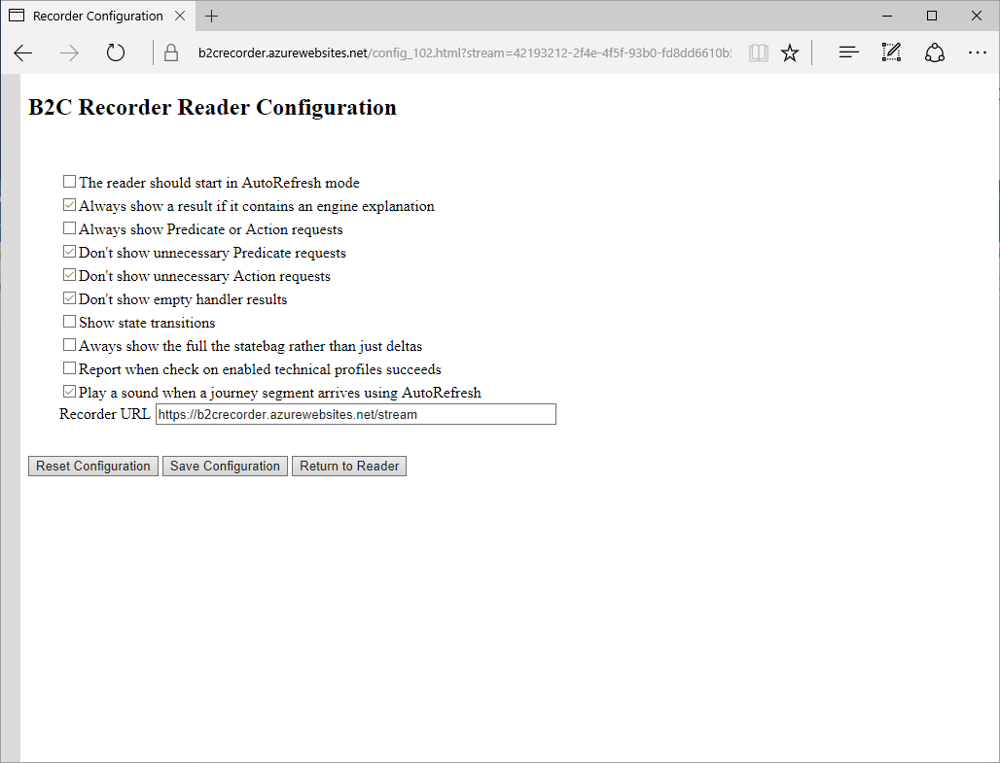

1.  Use **Download Stream** to download the recording to a file on your
    > local machine. The JSON content allows you to retrieve all the
    > above details for the executed premium policy:

\[

{

"Kind": "Headers",

"Content": {

"\$type": "Microsoft.Cpim.StateMachine.Recorders.V0\_3\_0\_0.Headers,
Microsoft.Cpim.StateMachine",

"UserJourneyRecorderEndpoint":
"https://b2crecorder.azurewebsites.net/stream?id=42193212-2f4e-4f5f-93b0-

fd8dd6610b5f",

"CorrelationId": "9a620bce-9f57-4163-a1a7-da17d9ea7417",

"EventInstance": "Event:AUTH",

"TenantId": "contoso369b2c.onmicrosoft.com",

"PolicyId": "B2C\_1A\_B2CSamplePolicy"

}

},

{

"Kind": "Transition",

"Content": {

"\$type": "IdentityExperienceEngine.Transition,
Microsoft.Cpim.StateMachine",

"EventName": "AUTH",

"StateName": "Initial"

}

},

{

"Kind": "Predicate",

"Content": "Web.TPEngine.StateMachineHandlers.NoOpHandler"

},

{

"Kind": "HandlerResult",

"Content": {

"\$type": "System.Collections.Generic.Dictionary\`2\[\[System.String,
mscorlib\],\[System.Object, mscorlib\]\], mscorlib",

"Result": true,

"Statebag": {

"\$type": "System.Collections.Generic.Dictionary\`2\[\[System.String,
mscorlib\],\[System.Object, mscorlib\]\], mscorlib",

"MACHSTATE": {

"\$type": "Microsoft.Cpim.StateMachine.StateBagItem,
Microsoft.Cpim.StateMachine",

"c": "2016-06-27T13:08:43.479912Z",

"k": "MACHSTATE",

"v": "Initial",

"p": true

},

"JC": {

"\$type": "Microsoft.Cpim.StateMachine.StateBagItem,
Microsoft.Cpim.StateMachine",

"c": "2016-06-27T13:08:43.479912Z",

"k": "JC",

"v": "en-US",

"p": true

},

"ComplexItems": "\_MachineEventQ, TCTX"

},

"PredicateResult": "True"

}

…

1.  Use **Delete Stream** to remove it. Use **Download Stream** to
    download the recording to a file on your local machine.

The next section illustrates how to use your own recorder/player
endpoints in lieu of the one provided by the “Starter Pack” of Azure AD
B2C Premium.

Using your own recorder/player endpoint
========================================

This section provides an end-to-end walkthrough from getting the source
code of the tool in the GitHub repository of the “Starter Pack” to the
classic use of the tool once deployed in Microsoft Azure as web site

Understanding the prerequisites of the user journey recorder
------------------------------------------------------------

The prerequisites for building and deploying your own user journey
recorder/player are the followings:

-   An active Azure subscription.

> **Note** If you don’t have any Azure subscription, you can sign up for
> a free account at
> [https://azure.microsoft.com/free/](https://azure.microsoft.com/free/).
> This will require to use a Microsoft account (e.g. xyz@outlook.com))

-   Visual Studio 2015 (to build and deploy your own user journey
    recorder/player)

> **Note** If you don’t have Visual Studio 2015, you can download
> [Microsoft Visual Studio Community
> 2015](https://go.microsoft.com/fwlink/?LinkId=691978&clcid=0x40c)
> for free at. See second part for additional information.

-   Notepad++, or another favorite XML editor. The Visual Studio 2015
    > editor cans be used for that purpose.

-   An Azure AD B2C tenant with Premium features activated.

 Building your user journey recorder/player
---------------------------------------------------------------------------------------------------------------------------

Microsoft is open-sourcing the UserJourneyRecorder package on
[GitHub](https://github.com/beejones/B2CDemoTools/tree/master/UserJourneyRecorder)
under the [MIT
license](https://github.com/beejones/B2CDemoTools/blob/master/LICENSE.md)
as part of the “Starter Pack” of Azure AD B2C Premium.

**The second part of the series of
documents depicts how to proceed to get started with the “Starter Pack”
of Azure AD B2C Premium.**

Regardless of the chosen option, i.e. getting the source package vs.
cloning the source package, the user journey recorder/player source
package is located under the *UserJourneyRecorder* folder of the
*Starter-Pack* folder of the “Starter Pack”.

To build the code you should have Visual Studio 2015 installed. You can
either open and build the **UserJourneyRecorder** solution with Visual
Studio 2015 and pressing F5, or build them on the command line using the
Developer Command Prompt.

### Opening the UserJourneyRecorder Visual Studio solution

To open the *UserJourneyRecorder.sln* solution file, proceed with the
following steps:

1.  Navigate to the *UserJourneyRecorder* folder of the “Starter Pack”.

2.  Open the *UserJourneyRecorder.sln* solution file. Visual Studio
    > launches. The following dialog opens up.

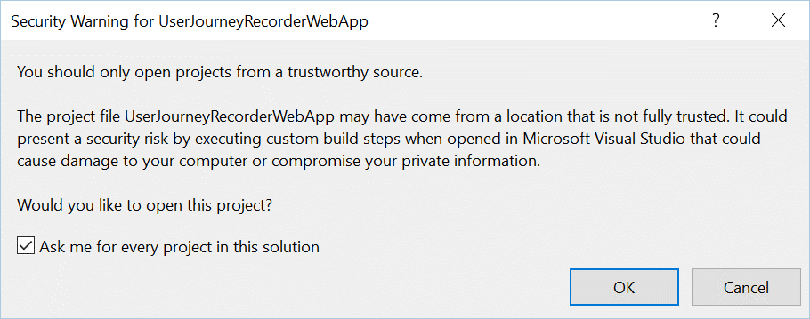

1.  Click **OK**. The solution completes to load with the
    > **UserJourneyWebApp** project.

### Resolving the code reference issues

Before being in a position to successfully compile the code, you need to
download all the packages that are referenced by the project.

Proceed with the following steps:

1.  Within Visual Studio 2015, open the Solution Explorer if not
    displayed in the UI of the integrated development environment (IDE).

2.  From the Solution Explorer, expand the **UserJourneyRecorder**
    solution along with the **UserJourneyRecorderWebApp** project.

3.  Under the **UserJourneyRecorderWebApp** project, scroll down to
    **References** and right-click it.

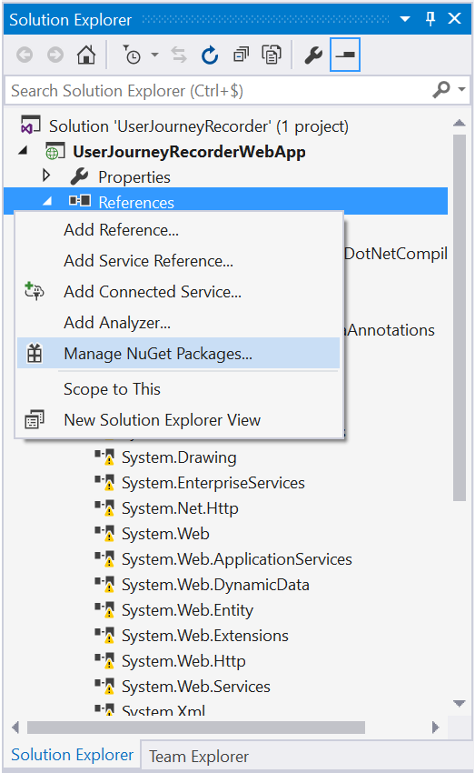

1.  Select **Manage NuGet Packages…** A **NuGet Package Manager:
    UserJourneyRecorderWebApp** window shows up.

1.  Click **Restore**. All the references should now be resolved, i.e.
    without having an exclamation mark in front of them, with the
    noticeable exception of the **System.Web.Http** assembly.

2.  Remove **System.Web.Http** by selecting it and pressing SUPPR.

3.  Right-click **References** and select Add Reference… A **Reference
    Manager: UserJourneyRecorderWebApp** dialog opens up.

4.  Click **Browse** on the right.

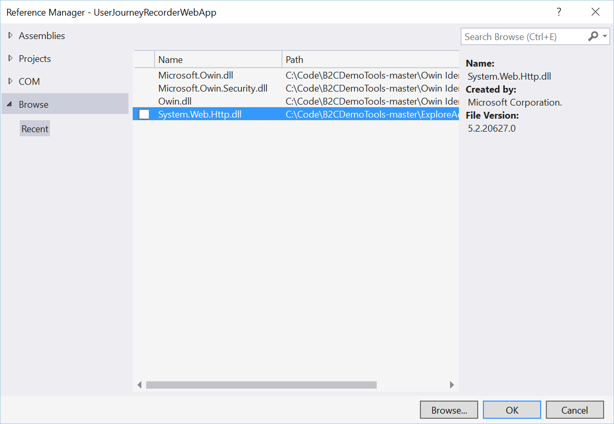

1.  Check **System.Web.Http.dll** and click **OK**.

All the references should now be resolved. You should have any assembly
listed as a reference with an exclamation mark in front of it. You are
now in a position to build the code of the **UserJourneyRecorderWebApp**
project.

### Building the code

To build the code you should have Visual Studio 2015 installed. You can
either than open and build the solutions with Visual Studio 2015 and
pressing F5, or build them on the command line using the Developer
Command Prompt.

To alternatively build with the command prompt, proceed with the
following steps:

1.  Open a **Developer Command Prompt for VS2015**.

> **Note** For more information on how to access the Developer Command
> Prompt, see the article [Developer Command Prompt for Visual
> Studio](https://msdn.microsoft.com/en-us/library/ms229859(v=vs.110).aspx).

1.  Navigate to the folder where you cloned the source code.

2.  Type the following command:

CopyMSBuild.exe

Deploying your own user journey recorder
----------------------------------------

Once successfully complied, and to eventually deploy your own user
journey recorder/player, proceed with the following steps:

1.  Within Visual Studio 2015, open the Solution Explorer if not
    displayed in the UI of the IDE.

2.  From the Solution Explorer, expand the **UserJourneyRecorder**
    solution.

3.  Right-click the **UserJourneyRecorderWebApp** project underneath,
    and then select **Publish…** A **Publish Web** dialog opens up.

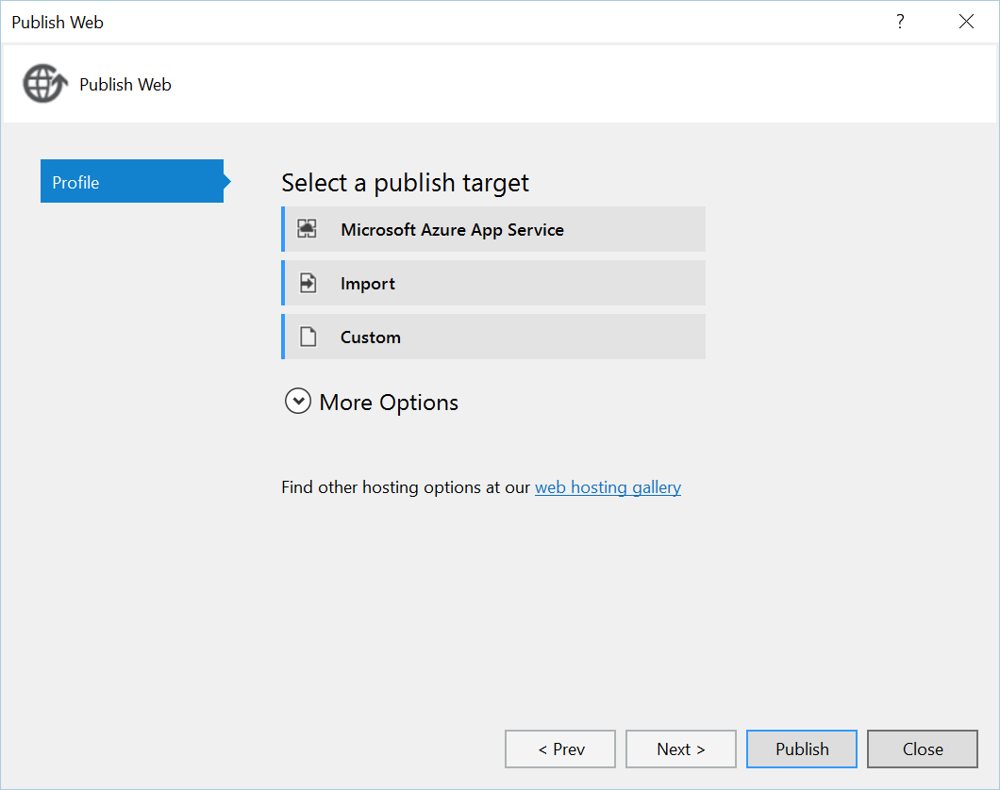

1.  Click **Microsoft Azure App Service** under **Select a publish
    target**. A **App Service** dialog opens up.

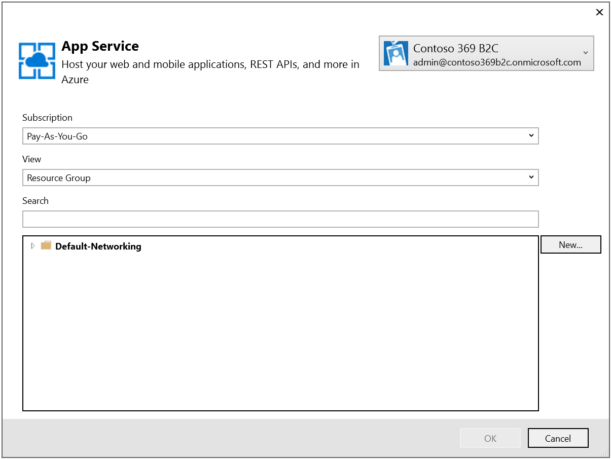

1.  Select the intended subscription in **Subscription** if not listed.

2.  Click **New**. A **Create App Service** dialog opens up.

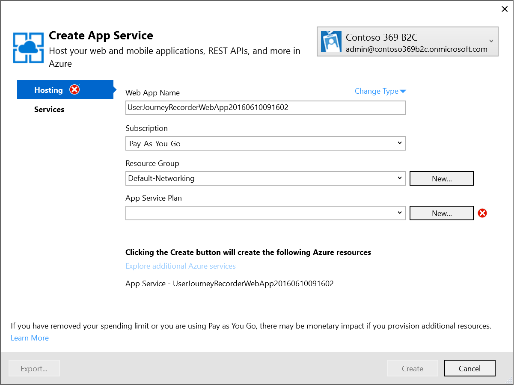

1.  Click **New** for **App Service Plan**. A **Configure App Service
    Plan** dialog opens up.

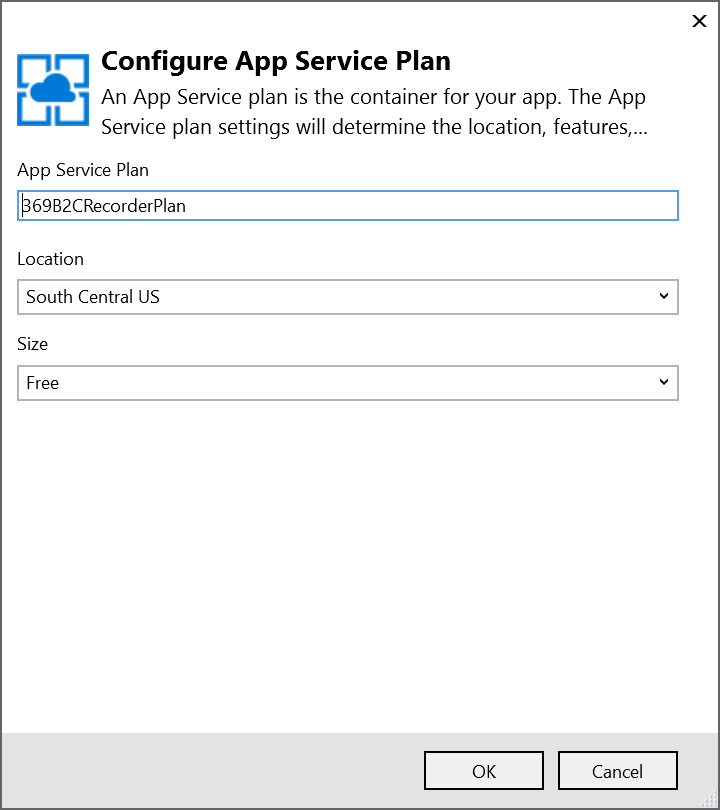 

1.  Specify the information for the App Service plan to configure:

    a.  Type the name of the App Service plan in **App Service Plan**,
        for example “*369B2CRecorderPlan*” in our illustration.

    b.  Set the location in **Location**.

    c.  Specify the size of the plan in **Size**.

2.  Once completed, click **OK**.

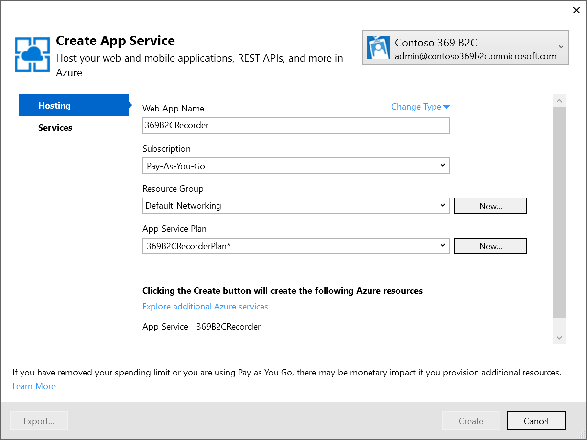

1.  Click **Create** once enabled.

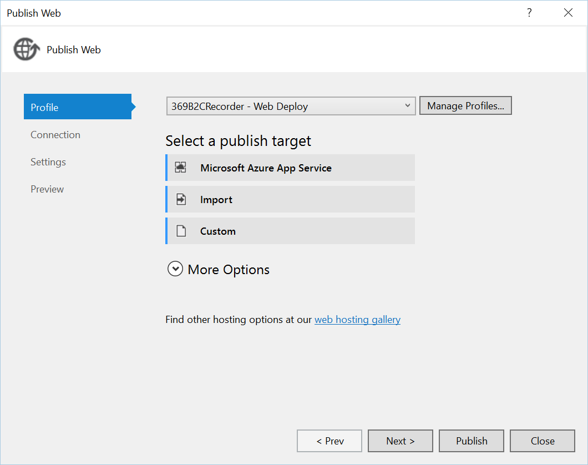

1.  Click **Next &gt;**.

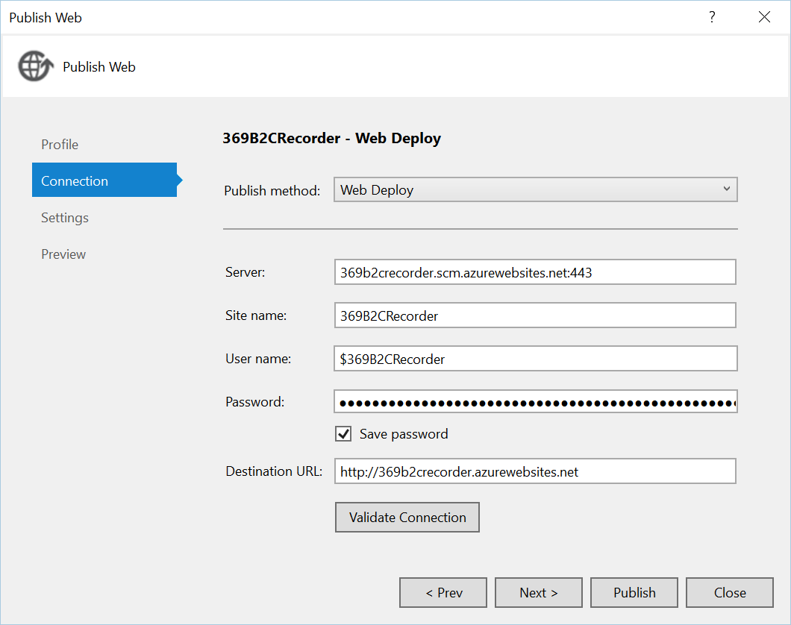

1.  Leave the form untouched, and then click **Next &gt;** again.

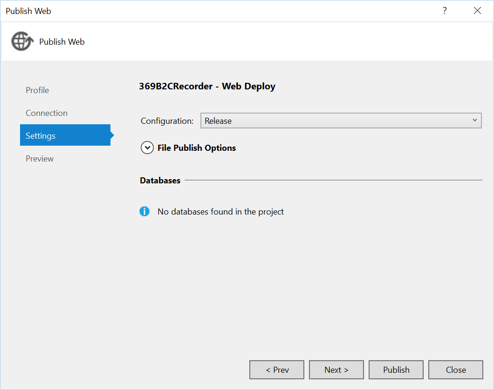

1.  Select the configuration to deploy, i.e. **Release** vs. **Debug**,
    in **Configuration**, and then click **Next &gt;**.

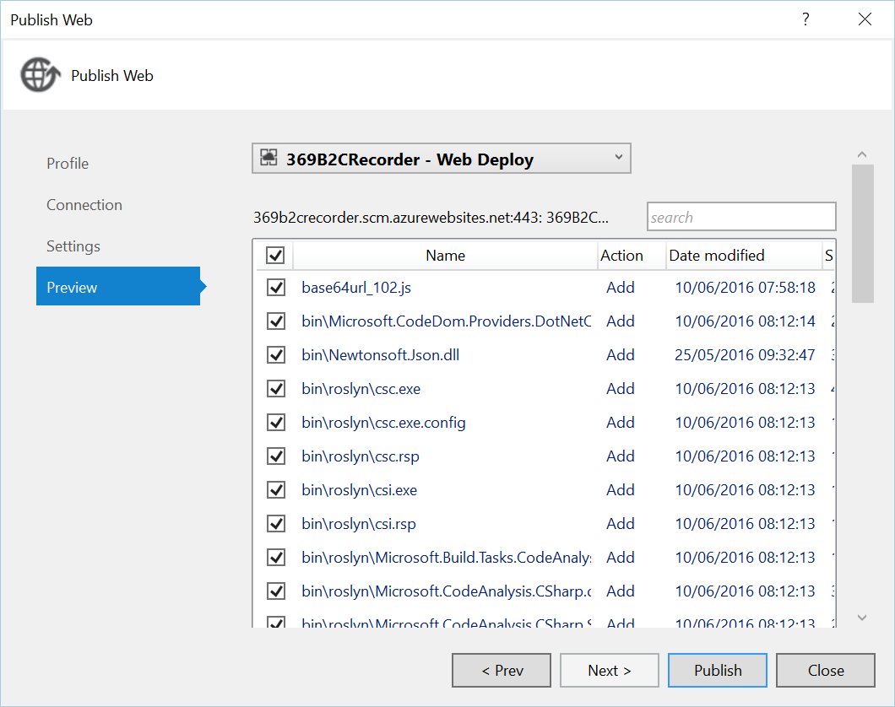

1.  Click **Publish**. Et voilà!

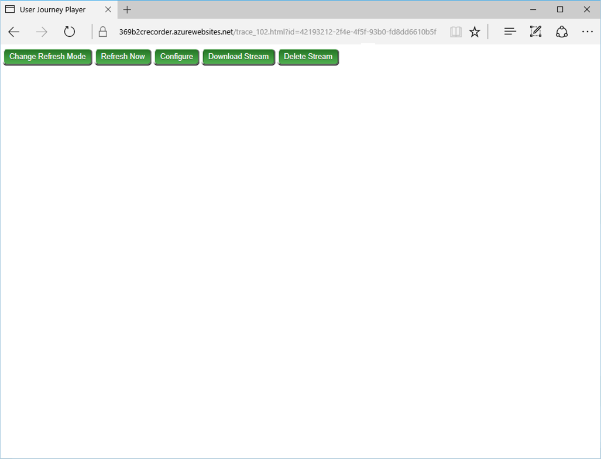

1.  Modify your policy in "Development Mode"
    to reflect this newly available endpoint for your own user journey
    recorder/player.

2.  Upload the modified policy

3.  Run your now uploaded policy as usual via **Run Now** for testing
    from the policy blade of the B2C portal in Azure or from a suitable
    B2C application.

4.  Use **Refresh Now** to see your recording. The details of the user
    journey will show up in your own user journey player.

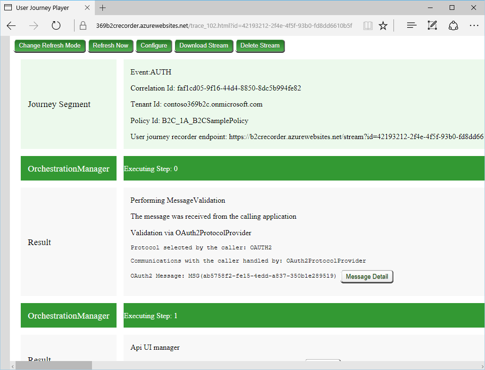

This concludes this fifth part of the series.

  -----------------------------------------------------------------------------------------------------------------------------------------------------------------------------------------------------------------------------------------------------------------------------------------------------------------------------------------------------------------------------------------------------------------------------
  The information contained in this document represents the current view of Microsoft Corporation on the issues discussed as of the date of publication. Because Microsoft must respond to changing market conditions, it should not be interpreted to be a commitment on the part of Microsoft, and Microsoft cannot guarantee the accuracy of any information presented after the date of publication.

  This white paper is for informational purposes only. Microsoft makes no warranties, express or implied, in this document.

  Complying with all applicable copyright laws is the responsibility of the user. Without limiting the rights under copyright, no part of this document may be reproduced, stored in, or introduced into a retrieval system, or transmitted in any form or by any means (electronic, mechanical, photocopying, recording, or otherwise), or for any purpose, without the express written permission of Microsoft Corporation.

  Microsoft may have patents, patent applications, trademarks, copyrights, or other intellectual property rights covering subject matter in this document. Except as expressly provided in any written license agreement from Microsoft, the furnishing of this document does not give you any license to these patents, trademarks, copyrights, or other intellectual property.

  © 2016 Microsoft Corporation. All rights reserved.

  The example companies, organizations, products, domain names, e-mail addresses, logos, people, places, and events depicted herein are fictitious. No association with any real company, organization, product, domain name, e-mail address, logo, person, place, or event is intended or should be inferred.

  Microsoft, list Microsoft trademarks used in your white paper alphabetically are either registered trademarks or trademarks of Microsoft Corporation in the United States and/or other countries.

  The names of actual companies and products mentioned herein may be the trademarks of their respective owners.
  -----------------------------------------------------------------------------------------------------------------------------------------------------------------------------------------------------------------------------------------------------------------------------------------------------------------------------------------------------------------------------------------------------------------------------
